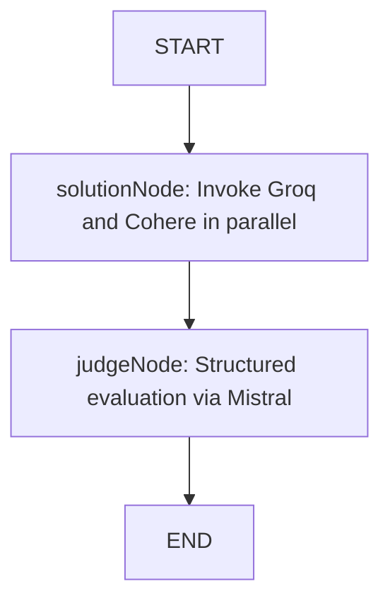

# AI Battle Arena — Developer Context & Onboarding Guide

Welcome to the **AI Battle Arena** project! This document serves as a complete map of the codebase, designed to get new developers up to speed quickly on the application's architecture, dependencies, data flows, and code structure.

---

## 🚀 Project Overview

The **AI Battle Arena** is a full-stack web application that allows users to prompt two separate LLM models (referred to as solvers) to generate alternative solutions to a given task or prompt. A third LLM model acts as a "judge" to score both solutions and recommend the better option (or declare a tie). 

### The AI Battle Flow:
1. **User Prompt**: The user initiates a prompt in an authenticated chat session.
2. **Topic Generation**: If it's a new chat, **Gemini** ([geminiModel](file:///c:/Users/Administrator/Desktop/HUSSAIN FullStackDev/Sheriyans Fulstack/Ai battle Arena/backend/src/services/Ai/AI.model.ts)) generates a concise 2–3 word topic/title for the chat.
3. **Dual Solution Generation**: The prompt is processed in parallel by:
   - **Groq** ([GroqModel](file:///c:/Users/Administrator/Desktop/HUSSAIN FullStackDev/Sheriyans Fulstack/Ai battle Arena/backend/src/services/Ai/AI.model.ts)) -> Output is stored as `solution1`
   - **Cohere** ([cohereModel](file:///c:/Users/Administrator/Desktop/HUSSAIN FullStackDev/Sheriyans Fulstack/Ai battle Arena/backend/src/services/Ai/AI.model.ts)) -> Output is stored as `solution2`
4. **Structured Evaluation & Judgement**: **Mistral** ([mistralModel](file:///c:/Users/Administrator/Desktop/HUSSAIN FullStackDev/Sheriyans Fulstack/Ai battle Arena/backend/src/services/Ai/AI.model.ts)) reviews the original prompt alongside both solutions, scores them from 1 to 10, and makes a recommendation.
5. **Storage & UI Delivery**: The backend persists the chat metadata, user prompt, both solutions, and the AI's preferences, sending the structured result back to the frontend.

---

## 🛠️ Technology Stack

### Backend
- **Runtime**: Node.js with ESM modules (`"type": "module"`)
- **Language**: TypeScript (compiled/executed via `tsx` dev server)
- **Framework**: Express.js (v5.x)
- **Database**: MongoDB (managed via Mongoose)
- **Orchestration**: LangChain & LangGraph (for multi-agent routing and structured validation)
- **Security**: JWT-based cookie session auth (`jsonwebtoken`, `cookie-parser`, `bcryptjs`)

### Frontend
- **Bundler & Tooling**: Vite with TypeScript
- **Language**: TypeScript
- **Framework**: React (v19.x)
- **Styling**: Tailwind CSS (v4.x using `@tailwindcss/vite`)
- **Routing**: React Router Dom (v7.x)
- **State Management**: Redux Toolkit (`@reduxjs/toolkit` and `react-redux`)
- **Forms**: React Hook Form

---

## 📂 Folder Structure

The project is structured as a monorepo consisting of distinct `backend` and `frontend` folders:

```text
Ai battle Arena/
├── backend/                       # Backend Application
│   ├── src/
│   │   ├── @types/                # Custom TypeScript type definitions
│   │   ├── configs/               # App configuration & DB connection
│   │   │   ├── config.ts
│   │   │   └── db.ts
│   │   ├── controllers/           # Route controllers (planned/modularized)
│   │   ├── jobs/                  # Background jobs / cron tasks
│   │   ├── middlewares/           # Express middlewares (Auth check)
│   │   │   └── User.middleware.ts
│   │   ├── models/                # Mongoose Database schemas
│   │   │   ├── chat.model.ts
│   │   │   ├── message.model.ts
│   │   │   └── user.model.ts
│   │   ├── routes/                # Express API routes
│   │   │   ├── ai.routes.ts
│   │   │   └── auth.routes.ts
│   │   ├── services/              # External services & LangGraph logic
│   │   │   └── Ai/
│   │   │       ├── AI.model.ts
│   │   │       └── Ai.graph.ts
│   │   └── utils/                 # Utility functions & helpers
│   │       ├── SendResponse.ts
│   │       └── setCookie.ts
│   │   └── app.ts                 # Express Application setup
│   ├── .env                       # Backend Environment Variables
│   ├── server.ts                  # Entry point for Backend
│   ├── tsconfig.json              # TypeScript compilation config
│   └── package.json               # Backend dependencies & scripts
│
└── frontend/                      # Frontend Client Application
    ├── public/                    # Static public assets (SVGs, icons)
    ├── src/
    │   ├── app/                   # App routing & global Redux store
    │   │   ├── redux/
    │   │   │   ├── hook.ts
    │   │   │   └── store.ts
    │   │   └── routes.tsx
    │   ├── assets/                # Visual media assets (logos, pictures)
    │   ├── features/              # Feature-scoped components & state
    │   │   └── auth/              # Auth pages, components, & slice
    │   │       ├── components/
    │   │       │   └── Input.tsx
    │   │       ├── pages/
    │   │       │   ├── Login.tsx
    │   │       │   └── Register.tsx
    │   │       └── authSlice.ts
    │   ├── App.tsx                # App root component
    │   ├── index.css              # Global styles (Tailwind v4 imports)
    │   └── main.tsx               # Client entry point
    ├── index.html                 # Main index template
    ├── vite.config.ts             # Vite configuration with Tailwind CSS plugin
    ├── tsconfig.json              # TypeScript configurations
    └── package.json               # Frontend dependencies & scripts
```

---

## 🧩 Backend Walkthrough

### 1. Configurations & Core Setup
- **[server.ts](file:///c:/Users/Administrator/Desktop/HUSSAIN FullStackDev/Sheriyans Fulstack/Ai battle Arena/backend/server.ts)**: The primary entry point. It calls the database connection function and binds the Express server to port `3000`.
- **[configs/config.ts](file:///c:/Users/Administrator/Desktop/HUSSAIN FullStackDev/Sheriyans Fulstack/Ai battle Arena/backend/src/configs/config.ts)**: Exposes a strongly-typed `CONFIG` object powered by `dotenv`. Holds keys for Mistral, Cohere, Google, Groq, MongoDB URI, JWT secret, and environment values.
- **[configs/db.ts](file:///c:/Users/Administrator/Desktop/HUSSAIN FullStackDev/Sheriyans Fulstack/Ai battle Arena/backend/src/configs/db.ts)**: Configures a MongoDB connection with a retry logic limit of `5` retries and a `5` seconds delay between retries to guarantee resilience.

### 2. Database Models
- **[user.model.ts](file:///c:/Users/Administrator/Desktop/HUSSAIN FullStackDev/Sheriyans Fulstack/Ai battle Arena/backend/src/models/user.model.ts)**:
  - Fields: `username`, `email` (unique), `password` (excluded from default select queries for security), and `tokens` (defaults to `1000`).
  - Contains a combined database index on `{ username: 1, email: 1 }` to optimize queries.
- **[chat.model.ts](file:///c:/Users/Administrator/Desktop/HUSSAIN FullStackDev/Sheriyans Fulstack/Ai battle Arena/backend/src/models/chat.model.ts)**:
  - Fields: `user` (ref to User), `topic` (defaults to current date/time), and timestamps.
- **[message.model.ts](file:///c:/Users/Administrator/Desktop/HUSSAIN FullStackDev/Sheriyans Fulstack/Ai battle Arena/backend/src/models/message.model.ts)**:
  - Fields: `user` (ref to User), `chat` (ref to Chat), `role` (`"user"` or `"ai"`), `content`, `solutionNumber` (`1` or `2` for AI responses, `0` for user prompt), `preferredByUser`, and `preferredByAi`.

### 3. Middlewares & Helpers
- **[User.middleware.ts](file:///c:/Users/Administrator/Desktop/HUSSAIN FullStackDev/Sheriyans Fulstack/Ai battle Arena/backend/src/middlewares/User.middleware.ts)**: Validates incoming HTTP requests via cookie-based JWT verification. Attaches the verified user ID to `req.user`. Returns a `401` status if the token is missing and a `403` status if it is invalid.
- **[setCookie.ts](file:///c:/Users/Administrator/Desktop/HUSSAIN FullStackDev/Sheriyans Fulstack/Ai battle Arena/backend/src/utils/setCookie.ts)**: Generates a JWT token valid for 1 day and writes it to the response cookies. Ensures high security in production by applying `httpOnly`, `secure`, and `sameSite: strict`.
- **[SendResponse.ts](file:///c:/Users/Administrator/Desktop/HUSSAIN FullStackDev/Sheriyans Fulstack/Ai battle Arena/backend/src/utils/SendResponse.ts)**: Safe utility wrapper for sending JSON responses to standard outputs.

### 4. Express API Routes
- **[auth.routes.ts](file:///c:/Users/Administrator/Desktop/HUSSAIN FullStackDev/Sheriyans Fulstack/Ai battle Arena/backend/src/routes/auth.routes.ts)**:
  - `POST /register`: Registers a new user, hashes password via `bcryptjs`, issues JWT cookie, and responds.
  - `POST /login`: Validates user credentials, sets JWT cookie, and responds.
  - `GET /logout`: Clears the authentication token cookie.
  - `GET /get-me`: Returns user info (requires auth middleware).
- **[ai.routes.ts](file:///c:/Users/Administrator/Desktop/HUSSAIN FullStackDev/Sheriyans Fulstack/Ai battle Arena/backend/src/routes/ai.routes.ts)**:
  - `POST /invoke-graph`: Core game node orchestration. Saves user prompts, fetches chat history, runs LangGraph evaluation, structures both model responses, marks the judge's preference, and saves all data.

### 5. Multi-Agent AI Architecture (LangGraph)
The AI system is split into two core files:
- **[AI.model.ts](file:///c:/Users/Administrator/Desktop/HUSSAIN FullStackDev/Sheriyans Fulstack/Ai battle Arena/backend/src/services/Ai/AI.model.ts)**: Instantiates instances of standard models:
  - `GroqModel`: `ChatGroq` utilizing `openai/gpt-oss-20b` (for Solution 1).
  - `cohereModel`: `ChatCohere` utilizing `command-a-03-2025` (for Solution 2).
  - `geminiModel`: `ChatGoogle` utilizing `gemini-3-flash-preview` (for Topic generation).
  - `mistralModel`: `ChatMistralAI` utilizing `ministral-3b-latest` (for Evaluation/Judge).
- **[Ai.graph.ts](file:///c:/Users/Administrator/Desktop/HUSSAIN FullStackDev/Sheriyans Fulstack/Ai battle Arena/backend/src/services/Ai/Ai.graph.ts)**: Defines the execution graph.



* **State Schema (`AIBATTLESTATE`)**: Contains `messages` (LangChain messages array), `solution1` (string), `solution2` (string), and `judgement` object matching the evaluation schema.
* **`solutionNode`**: Performs parallel invocations (`Promise.all`) of Groq and Cohere models over the chat history.
* **`judgeNode`**: Invokes Mistral using `.withStructuredOutput` to enforce a JSON object satisfying the Zod-defined `JudgeSchema`:
  ```typescript
  const JudgeSchema = z.object({
    solution1Score: z.number(),
    solution2Score: z.number(),
    recommendation: z.enum(["solution1", "solution2", "tie"]),
  });
  ```

---

## 💻 Frontend Walkthrough

The client is a single-page application built on a feature-based folder architecture:

### 1. Global App Shell & Infrastructure
- **[main.tsx](file:///c:/Users/Administrator/Desktop/HUSSAIN FullStackDev/Sheriyans Fulstack/Ai battle Arena/frontend/src/main.tsx)**: Wraps the client inside React `StrictMode`, provides the global Redux store (`Provider`), and connects the browser routing.
- **[App.tsx](file:///c:/Users/Administrator/Desktop/HUSSAIN FullStackDev/Sheriyans Fulstack/Ai battle Arena/frontend/src/App.tsx)**: Render hub returning the application routes container.
- **[routes.tsx](file:///c:/Users/Administrator/Desktop/HUSSAIN FullStackDev/Sheriyans Fulstack/Ai battle Arena/frontend/src/app/routes.tsx)**: Manages site routing using `BrowserRouter`. Declares paths for `/` (Home placeholder), `/login`, and `/register`.

### 2. State Management (Redux Store)
- **[store.ts](file:///c:/Users/Administrator/Desktop/HUSSAIN FullStackDev/Sheriyans Fulstack/Ai battle Arena/frontend/src/app/redux/store.ts)**: Aggregates Redux slices. Currently hosts the `auth` reducer.
- **[hook.ts](file:///c:/Users/Administrator/Desktop/HUSSAIN FullStackDev/Sheriyans Fulstack/Ai battle Arena/frontend/src/app/redux/hook.ts)**: Exports typed variants `useAppDispatch` and `useAppSelector` for IDE type-safety.
- **[authSlice.ts](file:///c:/Users/Administrator/Desktop/HUSSAIN FullStackDev/Sheriyans Fulstack/Ai battle Arena/frontend/src/features/auth/authSlice.ts)**: Handles authentication state. Exposes actions:
  - `authStart`: Sets loading state.
  - `authSuccess`: Caches user information and sets `isAuthenticated = true`.
  - `authFailure`: Stores authentication error messages.
  - `logout`: Resets state variables to default.
  - `setUser`: Direct mutation to override the user object.

### 3. Authentication Forms & Pages
- **[Input.tsx](file:///c:/Users/Administrator/Desktop/HUSSAIN FullStackDev/Sheriyans Fulstack/Ai battle Arena/frontend/src/features/auth/components/Input.tsx)**: A reusable input component designed to integrate with `react-hook-form` registers. Handles arbitrary types and placeholders.
- **[Login.tsx](file:///c:/Users/Administrator/Desktop/HUSSAIN FullStackDev/Sheriyans Fulstack/Ai battle Arena/frontend/src/features/auth/pages/Login.tsx)**: Interactive log-in page styled with dark zinc glassmorphic panels. Integrates `react-hook-form` validating email and password.
- **[Register.tsx](file:///c:/Users/Administrator/Desktop/HUSSAIN FullStackDev/Sheriyans Fulstack/Ai battle Arena/frontend/src/features/auth/pages/Register.tsx)**: Registration form requesting username, email, and password.

---

## ⚙️ Environment Configuration

To run this project locally, you must provide a `.env` file in the **`backend`** root directory. Create `backend/.env` with the following variables:

```ini
PORT=3000
NODE_ENV=development

# MongoDB Setup
MONGO_URI=mongodb+srv://<username>:<password>@cluster.mongodb.net/ai_battle_arena

# Security Key
JWT_SECRET_KEY=your_highly_secure_jwt_secret_key_here

# AI Model Credentials
GOOGLE_API_KEY=your_gemini_google_api_key
COHERE_API_KEY=your_cohere_api_key
MISTRAL_API_KEY=your_mistral_api_key
GROQ_API_KEY=your_groq_api_key
```

---

## 🛠️ Installation & Getting Started

### 1. Database & Pre-requisites
- Ensure you have **Node.js** (v18+ recommended) installed.
- Spin up a local MongoDB instance or configure a MongoDB Atlas cluster URI in `.env`.

### 2. Running the Backend
Go to the `backend` directory, install packages, and spin up the TypeScript file watcher:
```bash
cd backend
npm install
npm run dev
```
The backend server runs at `http://localhost:3000`.

### 3. Running the Frontend
Go to the `frontend` directory, install packages, and boot up the Vite server:
```bash
cd frontend
npm install
npm run dev
```
The frontend application runs at `http://localhost:5173`.
