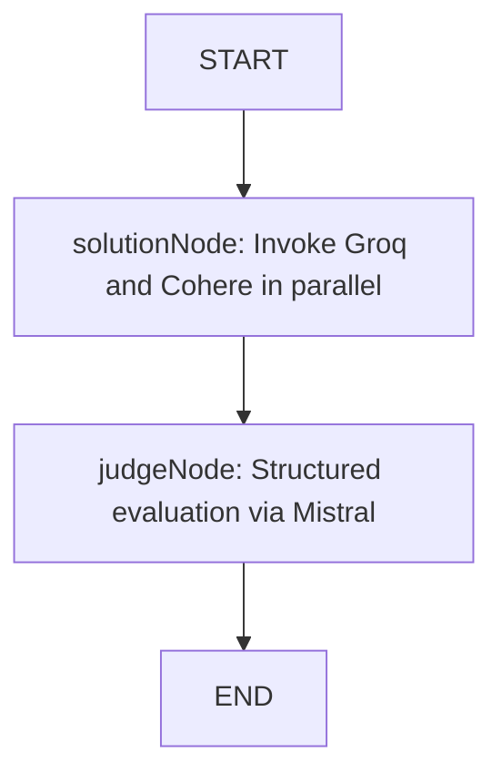

# AI Battle Arena — Developer Context & Onboarding Guide

Welcome to the **AI Battle Arena** project! This document serves as a complete map of the codebase, designed to get new developers up to speed quickly on the application's architecture, dependencies, data flows, and code structure.

---

## 🚀 Project Overview

The **AI Battle Arena** is a full-stack web application that allows users to prompt two separate LLM models (referred to as solvers) to generate alternative solutions to a given task or prompt. A third LLM model acts as a "judge" to score both solutions and recommend the better option (or declare a tie).

### The AI Battle Flow:
1. **User Prompt**: The user initiates a prompt in an authenticated chat session.
2. **Topic Generation**: If it's a new chat, **Gemini** ([geminiModel](file:///c:/Users/Administrator/Desktop/HUSSAIN%20FullStackDev/Sheriyans%20Fulstack/Ai%20battle%20Arena/backend/src/services/Ai/AI.model.ts)) generates a concise 2–3 word topic/title for the chat.
3. **Dual Solution Generation**: The prompt is processed in parallel by:
   - **Groq** ([GroqModel](file:///c:/Users/Administrator/Desktop/HUSSAIN%20FullStackDev/Sheriyans%20Fulstack/Ai%20battle%20Arena/backend/src/services/Ai/AI.model.ts)) -> Output is stored as `solution1`
   - **Cohere** ([cohereModel](file:///c:/Users/Administrator/Desktop/HUSSAIN%20FullStackDev/Sheriyans%20Fulstack/Ai%20battle%20Arena/backend/src/services/Ai/AI.model.ts)) -> Output is stored as `solution2`
4. **Structured Evaluation & Judgement**: **Mistral** ([mistralModel](file:///c:/Users/Administrator/Desktop/HUSSAIN%20FullStackDev/Sheriyans%20Fulstack/Ai%20battle%20Arena/backend/src/services/Ai/AI.model.ts)) reviews the original prompt alongside both solutions, scores them from 1 to 10, and makes a recommendation.
5. **Storage & UI Delivery**: The backend persists the chat metadata, user prompt, both solutions, and the AI's preferences, sending the structured result back to the frontend.

### LangGraph API Response Shape
The backend `/invoke-graph` endpoint returns data in this structure:
```json
{
  "messages": [{ "kwargs": { "content": "user prompt" } }],
  "solution1": "Groq's response text",
  "solution2": "Cohere's response text",
  "judgement": {
    "solution1Score": 9,
    "solution2Score": 9,
    "recommendation": "tie"
  },
  "chatId": "6a548e77d1d283ce2ddc01c8"
}
```
The `recommendation` field is one of `"solution1"`, `"solution2"`, or `"tie"`.

---

## 🛠️ Technology Stack

### Backend
- **Runtime**: Node.js with ESM modules (`"type": "module"`)
- **Language**: TypeScript (compiled/executed via `tsx` dev server)
- **Framework**: Express.js (v5.x)
- **Database**: MongoDB (managed via Mongoose)
- **Orchestration**: LangChain & LangGraph (for multi-agent routing and structured validation)
- **Security**: JWT-based cookie session auth (`jsonwebtoken`, `cookie-parser`, `bcryptjs`)

### Frontend
- **Bundler & Tooling**: Vite with TypeScript
- **Language**: TypeScript
- **Framework**: React (v19.x)
- **Styling**: Tailwind CSS (v4.x using `@tailwindcss/vite`) + Custom CSS Variables Design System
- **Routing**: React Router Dom (v7.x)
- **State Management**: Redux Toolkit (`@reduxjs/toolkit` and `react-redux`)
- **Forms**: React Hook Form
- **Fonts**: Inter (Google Fonts — loaded via `@import` in `index.css`)

---

## 📂 Folder Structure

The project is structured as a monorepo consisting of distinct `backend` and `frontend` folders:

```text
Ai battle Arena/
├── backend/                       # Backend Application
│   ├── src/
│   │   ├── @types/                # Custom TypeScript type definitions
│   │   ├── configs/               # App configuration & DB connection
│   │   │   ├── config.ts
│   │   │   └── db.ts
│   │   ├── controllers/           # Route controllers (planned/modularized)
│   │   ├── jobs/                  # Background jobs / cron tasks
│   │   ├── middlewares/           # Express middlewares (Auth check)
│   │   │   └── User.middleware.ts
│   │   ├── models/                # Mongoose Database schemas
│   │   │   ├── chat.model.ts
│   │   │   ├── message.model.ts
│   │   │   └── user.model.ts
│   │   ├── routes/                # Express API routes
│   │   │   ├── ai.routes.ts
│   │   │   └── auth.routes.ts
│   │   ├── services/              # External services & LangGraph logic
│   │   │   └── Ai/
│   │   │       ├── AI.model.ts
│   │   │       └── Ai.graph.ts
│   │   └── utils/                 # Utility functions & helpers
│   │       ├── SendResponse.ts
│   │       └── setCookie.ts
│   │   └── app.ts                 # Express Application setup
│   ├── .env                       # Backend Environment Variables
│   ├── server.ts                  # Entry point for Backend
│   ├── tsconfig.json              # TypeScript compilation config
│   └── package.json               # Backend dependencies & scripts
│
└── frontend/                      # Frontend Client Application
    ├── public/                    # Static public assets (SVGs, icons)
    ├── src/
    │   ├── app/                   # App routing & global Redux store
    │   │   ├── redux/
    │   │   │   ├── hook.ts
    │   │   │   └── store.ts       # ← Now hosts auth + chat reducers
    │   │   └── routes.tsx         # ← Updated: / and /chat → Chat page
    │   ├── assets/                # Visual media assets (logos, pictures)
    │   ├── features/              # Feature-scoped components & state
    │   │   ├── auth/              # Auth pages, components, & slice
    │   │   │   ├── components/
    │   │   │   │   └── Input.tsx  # ← Enhanced: icon slot + password toggle
    │   │   │   ├── pages/
    │   │   │   │   ├── Login.tsx  # ← Redesigned: glassmorphic dark UI
    │   │   │   │   └── Register.tsx # ← Redesigned: matching dark UI
    │   │   │   └── authSlice.ts
    │   │   └── chat/              # ← NEW: Chat feature
    │   │       ├── pages/
    │   │       │   └── Chat.tsx   # ← NEW: Full chat UI
    │   │       └── chatSlice.ts   # ← NEW: Chat Redux slice
    │   ├── App.tsx                # App root component
    │   ├── index.css              # ← Redesigned: full design system
    │   └── main.tsx               # Client entry point
    ├── index.html                 # Main index template
    ├── vite.config.ts             # Vite configuration with Tailwind CSS plugin
    ├── tsconfig.json              # TypeScript configurations
    └── package.json               # Frontend dependencies & scripts
```

---

## 🧩 Backend Walkthrough

### 1. Configurations & Core Setup
- **[server.ts](file:///c:/Users/Administrator/Desktop/HUSSAIN%20FullStackDev/Sheriyans%20Fulstack/Ai%20battle%20Arena/backend/server.ts)**: The primary entry point. It calls the database connection function and binds the Express server to port `3000`.
- **[configs/config.ts](file:///c:/Users/Administrator/Desktop/HUSSAIN%20FullStackDev/Sheriyans%20Fulstack/Ai%20battle%20Arena/backend/src/configs/config.ts)**: Exposes a strongly-typed `CONFIG` object powered by `dotenv`. Holds keys for Mistral, Cohere, Google, Groq, MongoDB URI, JWT secret, and environment values.
- **[configs/db.ts](file:///c:/Users/Administrator/Desktop/HUSSAIN%20FullStackDev/Sheriyans%20Fulstack/Ai%20battle%20Arena/backend/src/configs/db.ts)**: Configures a MongoDB connection with a retry logic limit of `5` retries and a `5` seconds delay between retries to guarantee resilience.

### 2. Database Models
- **[user.model.ts](file:///c:/Users/Administrator/Desktop/HUSSAIN%20FullStackDev/Sheriyans%20Fulstack/Ai%20battle%20Arena/backend/src/models/user.model.ts)**:
  - Fields: `username`, `email` (unique), `password` (excluded from default select queries for security), and `tokens` (defaults to `1000`).
  - Contains a combined database index on `{ username: 1, email: 1 }` to optimize queries.
- **[chat.model.ts](file:///c:/Users/Administrator/Desktop/HUSSAIN%20FullStackDev/Sheriyans%20Fulstack/Ai%20battle%20Arena/backend/src/models/chat.model.ts)**:
  - Fields: `user` (ref to User), `topic` (defaults to current date/time), and timestamps.
- **[message.model.ts](file:///c:/Users/Administrator/Desktop/HUSSAIN%20FullStackDev/Sheriyans%20Fulstack/Ai%20battle%20Arena/backend/src/models/message.model.ts)**:
  - Fields: `user` (ref to User), `chat` (ref to Chat), `role` (`"user"` or `"ai"`), `content`, `solutionNumber` (`1` or `2` for AI responses, `0` for user prompt), `preferredByUser`, and `preferredByAi`.

### 3. Middlewares & Helpers
- **[User.middleware.ts](file:///c:/Users/Administrator/Desktop/HUSSAIN%20FullStackDev/Sheriyans%20Fulstack/Ai%20battle%20Arena/backend/src/middlewares/User.middleware.ts)**: Validates incoming HTTP requests via cookie-based JWT verification. Attaches the verified user ID to `req.user`. Returns a `401` status if the token is missing and a `403` status if it is invalid.
- **[setCookie.ts](file:///c:/Users/Administrator/Desktop/HUSSAIN%20FullStackDev/Sheriyans%20Fulstack/Ai%20battle%20Arena/backend/src/utils/setCookie.ts)**: Generates a JWT token valid for 1 day and writes it to the response cookies. Ensures high security in production by applying `httpOnly`, `secure`, and `sameSite: strict`.
- **[SendResponse.ts](file:///c:/Users/Administrator/Desktop/HUSSAIN%20FullStackDev/Sheriyans%20Fulstack/Ai%20battle%20Arena/backend/src/utils/SendResponse.ts)**: Safe utility wrapper for sending JSON responses to standard outputs.

### 4. Express API Routes
- **[auth.routes.ts](file:///c:/Users/Administrator/Desktop/HUSSAIN%20FullStackDev/Sheriyans%20Fulstack/Ai%20battle%20Arena/backend/src/routes/auth.routes.ts)**:
  - `POST /register`: Registers a new user, hashes password via `bcryptjs`, issues JWT cookie, and responds.
  - `POST /login`: Validates user credentials, sets JWT cookie, and responds.
  - `GET /logout`: Clears the authentication token cookie.
  - `GET /get-me`: Returns user info (requires auth middleware).
- **[ai.routes.ts](file:///c:/Users/Administrator/Desktop/HUSSAIN%20FullStackDev/Sheriyans%20Fulstack/Ai%20battle%20Arena/backend/src/routes/ai.routes.ts)**:
  - `POST /invoke-graph`: Core game node orchestration. Saves user prompts, fetches chat history, runs LangGraph evaluation, structures both model responses, marks the judge's preference, and saves all data.

### 5. Multi-Agent AI Architecture (LangGraph)
The AI system is split into two core files:
- **[AI.model.ts](file:///c:/Users/Administrator/Desktop/HUSSAIN%20FullStackDev/Sheriyans%20Fulstack/Ai%20battle%20Arena/backend/src/services/Ai/AI.model.ts)**: Instantiates instances of standard models:
  - `GroqModel`: `ChatGroq` utilizing `openai/gpt-oss-20b` (for Solution 1).
  - `cohereModel`: `ChatCohere` utilizing `command-a-03-2025` (for Solution 2).
  - `geminiModel`: `ChatGoogle` utilizing `gemini-3-flash-preview` (for Topic generation).
  - `mistralModel`: `ChatMistralAI` utilizing `ministral-3b-latest` (for Evaluation/Judge).
- **[Ai.graph.ts](file:///c:/Users/Administrator/Desktop/HUSSAIN%20FullStackDev/Sheriyans%20Fulstack/Ai%20battle%20Arena/backend/src/services/Ai/Ai.graph.ts)**: Defines the execution graph.



* **State Schema (`AIBATTLESTATE`)**: Contains `messages` (LangChain messages array), `solution1` (string), `solution2` (string), and `judgement` object matching the evaluation schema.
* **`solutionNode`**: Performs parallel invocations (`Promise.all`) of Groq and Cohere models over the chat history.
* **`judgeNode`**: Invokes Mistral using `.withStructuredOutput` to enforce a JSON object satisfying the Zod-defined `JudgeSchema`:
  ```typescript
  const JudgeSchema = z.object({
    solution1Score: z.number(),
    solution2Score: z.number(),
    recommendation: z.enum(["solution1", "solution2", "tie"]),
  });
  ```

---

## 💻 Frontend Walkthrough

The client is a single-page application built on a feature-based folder architecture.

### 1. Global App Shell & Infrastructure
- **[main.tsx](file:///c:/Users/Administrator/Desktop/HUSSAIN%20FullStackDev/Sheriyans%20Fulstack/Ai%20battle%20Arena/frontend/src/main.tsx)**: Wraps the client inside React `StrictMode`, provides the global Redux store (`Provider`), and connects the browser routing.
- **[App.tsx](file:///c:/Users/Administrator/Desktop/HUSSAIN%20FullStackDev/Sheriyans%20Fulstack/Ai%20battle%20Arena/frontend/src/App.tsx)**: Render hub returning the application routes container.
- **[routes.tsx](file:///c:/Users/Administrator/Desktop/HUSSAIN%20FullStackDev/Sheriyans%20Fulstack/Ai%20battle%20Arena/frontend/src/app/routes.tsx)**: Manages site routing using `BrowserRouter`. Routes:
  - `/` → `<Chat />` (main arena page)
  - `/chat` → `<Chat />` (explicit alias)
  - `/login` → `<Login />`
  - `/register` → `<Register />`

### 2. State Management (Redux Store)
- **[store.ts](file:///c:/Users/Administrator/Desktop/HUSSAIN%20FullStackDev/Sheriyans%20Fulstack/Ai%20battle%20Arena/frontend/src/app/redux/store.ts)**: Aggregates Redux slices. Hosts both the `auth` and `chat` reducers.
- **[hook.ts](file:///c:/Users/Administrator/Desktop/HUSSAIN%20FullStackDev/Sheriyans%20Fulstack/Ai%20battle%20Arena/frontend/src/app/redux/hook.ts)**: Exports typed variants `useAppDispatch` and `useAppSelector` for IDE type-safety.
- **[authSlice.ts](file:///c:/Users/Administrator/Desktop/HUSSAIN%20FullStackDev/Sheriyans%20Fulstack/Ai%20battle%20Arena/frontend/src/features/auth/authSlice.ts)**: Handles authentication state. Exposes actions:
  - `authStart`: Sets loading state.
  - `authSuccess`: Caches user information and sets `isAuthenticated = true`.
  - `authFailure`: Stores authentication error messages.
  - `logout`: Resets state variables to default.
  - `setUser`: Direct mutation to override the user object.
- **[chatSlice.ts](file:///c:/Users/Administrator/Desktop/HUSSAIN%20FullStackDev/Sheriyans%20Fulstack/Ai%20battle%20Arena/frontend/src/features/chat/chatSlice.ts)** *(NEW)*: Handles chat state. Key types and actions:
  - **Types**: `Judgement` (`solution1Score`, `solution2Score`, `recommendation`), `ChatMessage` (supports both user and AI roles with dual solutions), `ChatSession` (chatId, topic, createdAt).
  - `chatStart`: Sets `isLoading = true`.
  - `addUserMessage`: Appends a user message to the messages array.
  - `addAIResponse`: Appends the AI dual-response (solution1, solution2, judgement) and clears loading.
  - `chatFailure`: Stores error message.
  - `setActiveChatId`: Tracks which chat session is open.
  - `setSessions` / `addSession`: Manages the sidebar chat history list.
  - `clearMessages`: Resets the current conversation.

### 3. Authentication Forms & Pages
- **[Input.tsx](file:///c:/Users/Administrator/Desktop/HUSSAIN%20FullStackDev/Sheriyans%20Fulstack/Ai%20battle%20Arena/frontend/src/features/auth/components/Input.tsx)** *(Enhanced)*: A reusable dark-styled input component. Features:
  - Accepts an optional `icon` prop (ReactNode) rendered on the left side.
  - Password fields automatically gain a **show/hide eye toggle** button on the right.
  - Uses the `.input-arena` CSS class: dark `#13151f` background, subtle border, and a **cyan glow** (`box-shadow`) on focus.
  - Fully compatible with `react-hook-form` via the `register` prop.

- **[Login.tsx](file:///c:/Users/Administrator/Desktop/HUSSAIN%20FullStackDev/Sheriyans%20Fulstack/Ai%20battle%20Arena/frontend/src/features/auth/pages/Login.tsx)** *(Redesigned)*: Premium dark login page. Features:
  - Full-screen `#090b10` background with two ambient radial glow blobs (cyan + purple).
  - Central **glassmorphic card** (`rgba(16,18,26,0.7)` + `backdrop-filter: blur`) with subtle outer glow border.
  - **Brand header**: Shield/gradient SVG icon + "AI BATTLE ARENA" label + "Enter the Arena" subtitle.
  - Inputs: Email (with envelope icon) and Password (with lock icon + eye toggle).
  - **Sign In** button: Full-width cyan→blue gradient with glow shadow, hover animates the gradient.
  - Footer: "Forgot password?" link + "Don't have an account? Register" link in cyan.

- **[Register.tsx](file:///c:/Users/Administrator/Desktop/HUSSAIN%20FullStackDev/Sheriyans%20Fulstack/Ai%20battle%20Arena/frontend/src/features/auth/pages/Register.tsx)** *(Redesigned)*: Matches Login's aesthetic with purple accent theming.
  - Purple ambient glow blobs.
  - "Join the Arena" subtitle and "Create Account" heading.
  - Three inputs: Username (user icon), Email (envelope icon), Password (lock icon + eye toggle).
  - **Create Account** button: Purple→pink→cyan gradient variant.

### 4. Chat Page & Feature *(NEW)*
- **[Chat.tsx](file:///c:/Users/Administrator/Desktop/HUSSAIN%20FullStackDev/Sheriyans%20Fulstack/Ai%20battle%20Arena/frontend/src/features/chat/pages/Chat.tsx)**: The main application screen. Layout is a full-height flex row split into a sidebar and a main panel.

#### Sidebar (280px fixed)
- **Brand header**: Shield logo + "AI BATTLE ARENA" / "Arena Chat" title.
- **New Chat button**: Cyan-accented ghost button — clears the current conversation.
- **Recent Battles list**: Chat history items. The active session is highlighted with a left cyan border bar.
- **User footer**: Avatar (gradient circle with initials) + name + role label.

#### Main Panel
- **Top bar**: "AI Battle Arena" title + "Groq vs Cohere — judged by Mistral" subtitle + pulsing "Live Arena" badge.
- **Message area** (scrollable): Renders `<MessageGroup>` for each message in the conversation:
  - **User messages**: Right-aligned cyan-tinted bubble.
  - **AI response groups**:
    - A "GROQ vs COHERE" divider badge separates the group.
    - Two `<SolutionCard>` components side-by-side:
      - **Groq card**: Cyan top border (`#00d2ff`), score badge, content text. If winner → `★ Winner` badge + intensified glow.
      - **Cohere card**: Purple top border (`#a855f7`), score badge, content text. Same winner logic.
    - `<JudgeVerdictPanel>`: Amber (`#f59e0b`) bordered panel with trophy icon, verdict text (`TIE` / `GROQ WINS` / `COHERE WINS`), subtitle, and individual score chips.
- **Loading state**: Three pulsing cyan dots with "Models are thinking..." text.
- **Empty state**: Centered shield icon + "Start a Battle" prompt.

#### Input Bar (fixed bottom)
- Auto-expanding `<textarea>` (min 1 row, max 5 rows) with `Enter` to send and `Shift+Enter` for newline.
- Glowing cyan **Send** button (disabled while loading or empty).
- Hint text: keyboard shortcut reminder.

#### Inline Sub-Components (all in Chat.tsx)
| Component | Purpose |
|---|---|
| `<ScoreBadge>` | Colored pill showing `N/10` score |
| `<SolutionCard>` | Individual AI response card with winner state |
| `<JudgeVerdictPanel>` | Full amber verdict display with scores |
| `<MessageGroup>` | Routes user vs AI messages to correct layout |

---

## 🎨 Design System — "Neon Protocol"

The frontend now uses a unified CSS design system defined in [index.css](file:///c:/Users/Administrator/Desktop/HUSSAIN%20FullStackDev/Sheriyans%20Fulstack/Ai%20battle%20Arena/frontend/src/index.css) via CSS custom properties:

### Color Palette
| Token | Value | Usage |
|---|---|---|
| `--bg-floor` | `#090b10` | Page background |
| `--bg-sidebar` | `#0a0c13` | Sidebar background |
| `--bg-card` | `rgba(16,18,26,0.6)` | Glassmorphic card base |
| `--bg-input` | `#13151f` | Input field background |
| `--cyan` | `#00d2ff` | Groq accent, primary CTA, active states |
| `--purple` | `#a855f7` | Cohere accent, Register button |
| `--amber` | `#f59e0b` | Judge verdict, winner highlight |
| `--text-primary` | `#e2e8f0` | Body text |
| `--text-secondary` | `#94a3b8` | Subtitles, labels |
| `--text-muted` | `#4b5563` | Placeholders, timestamps |
| `--border-subtle` | `rgba(255,255,255,0.07)` | Default card borders |

### Typography
- **Font**: Inter (Google Fonts) loaded via `@import` at the top of `index.css`.
- Applied globally via `font-family: 'Inter', system-ui, sans-serif` on `body`.
- `-webkit-font-smoothing: antialiased` for crisp rendering.

### Utility Classes
| Class | Effect |
|---|---|
| `.glass` | `backdrop-filter: blur(12px)` + semi-transparent bg + border |
| `.glass-hover` | Darker bg + stronger border on hover |
| `.animate-fade-in` | `translateY(8px) → 0` + opacity fade, 350ms |
| `.animate-slide-in` | `translateX(20px) → 0` + opacity fade, 350ms |
| `.glow-cyan` / `.glow-purple` / `.glow-amber` | Colored `box-shadow` glow |
| `.gradient-text-cyan` | Cyan→blue gradient clipped to text |
| `.btn-primary` | Cyan→blue→purple gradient button with hover animation |
| `.input-arena` | Dark input with cyan focus glow ring |

### Keyframe Animations
| Name | Effect |
|---|---|
| `fadeIn` | Fade + slide up (used on all new message groups) |
| `slideInRight` | Slide in from right (used on AI response groups) |
| `pulseGlow` | Cyan box-shadow pulse (live status dot) |
| `pulseGlowPurple` | Purple box-shadow pulse |
| `shimmer` | Gradient shimmer for loading skeletons |
| `bgFloat` | Subtle float + scale for ambient glow blobs |

---

## ⚙️ Environment Configuration

To run this project locally, you must provide a `.env` file in the **`backend`** root directory. Create `backend/.env` with the following variables:

```ini
PORT=3000
NODE_ENV=development

# MongoDB Setup
MONGO_URI=mongodb+srv://<username>:<password>@cluster.mongodb.net/ai_battle_arena

# Security Key
JWT_SECRET_KEY=your_highly_secure_jwt_secret_key_here

# AI Model Credentials
GOOGLE_API_KEY=your_gemini_google_api_key
COHERE_API_KEY=your_cohere_api_key
MISTRAL_API_KEY=your_mistral_api_key
GROQ_API_KEY=your_groq_api_key
```

---

## 🛠️ Installation & Getting Started

### 1. Database & Pre-requisites
- Ensure you have **Node.js** (v18+ recommended) installed.
- Spin up a local MongoDB instance or configure a MongoDB Atlas cluster URI in `.env`.

### 2. Running the Backend
Go to the `backend` directory, install packages, and spin up the TypeScript file watcher:
```bash
cd backend
npm install
npm run dev
```
The backend server runs at `http://localhost:3000`.

### 3. Running the Frontend
Go to the `frontend` directory, install packages, and boot up the Vite server:
```bash
cd frontend
npm install
npm run dev
```
The frontend application runs at `http://localhost:5173` (or `5174` if port is in use).

---

## 🔌 Connecting Frontend to Backend (Chat Flow)

When integrating the real API, replace the `setTimeout` demo simulation in [Chat.tsx](file:///c:/Users/Administrator/Desktop/HUSSAIN%20FullStackDev/Sheriyans%20Fulstack/Ai%20battle%20Arena/frontend/src/features/chat/pages/Chat.tsx) with a real `fetch` call:

```typescript
// POST to /api/invoke-graph
const res = await fetch('/api/invoke-graph', {
  method: 'POST',
  credentials: 'include',          // send JWT cookie
  headers: { 'Content-Type': 'application/json' },
  body: JSON.stringify({
    message: text,
    chatId: activeChatId ?? undefined,
  }),
});

const data = await res.json();
// data shape: { solution1, solution2, judgement, chatId }

const aiMsg: ChatMessage = {
  id: uid(),
  role: 'ai',
  solution1: data.solution1,
  solution2: data.solution2,
  judgement: data.judgement,
};
```

The `chatId` returned from the first message should be stored in `activeChatId` (via `setActiveChatId` action) so subsequent messages in the same session are appended to the correct chat document in MongoDB.
